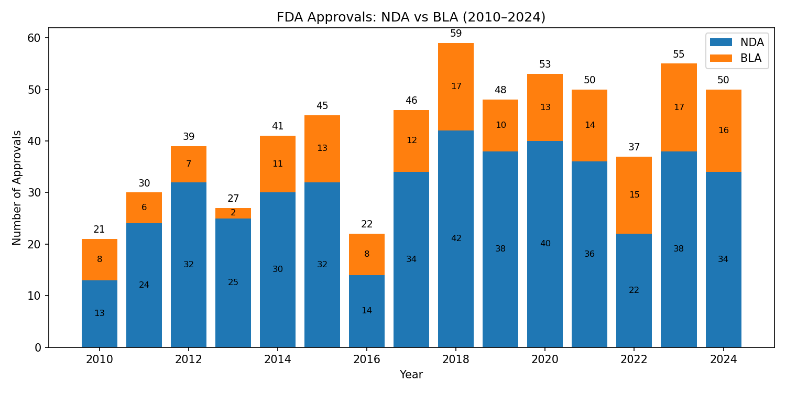
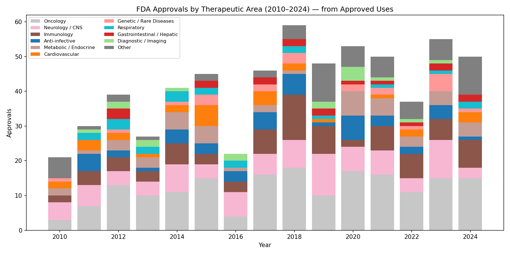
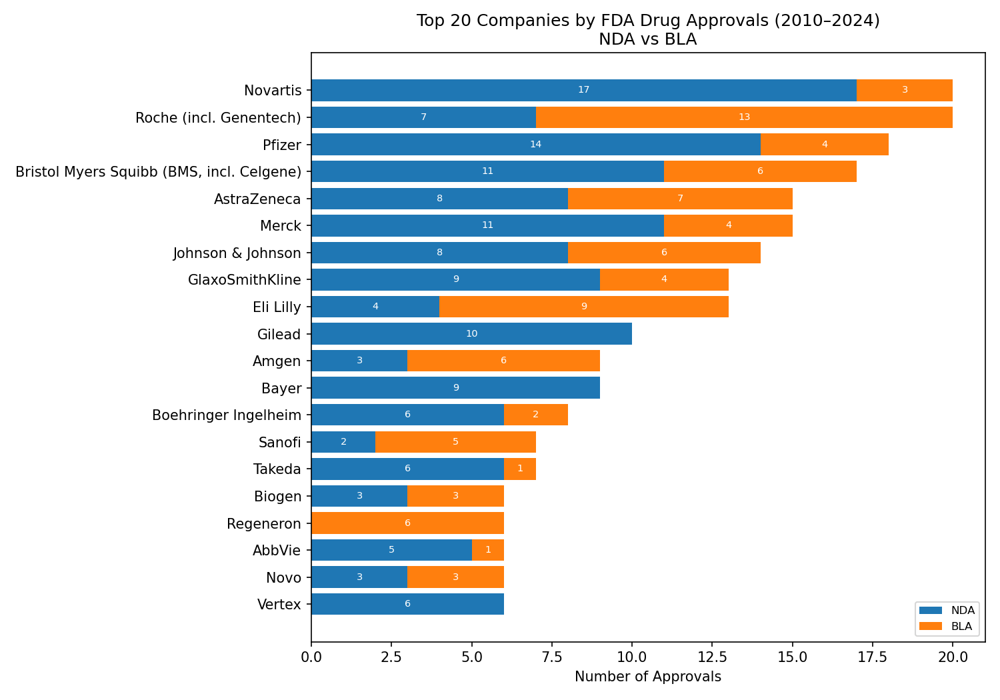
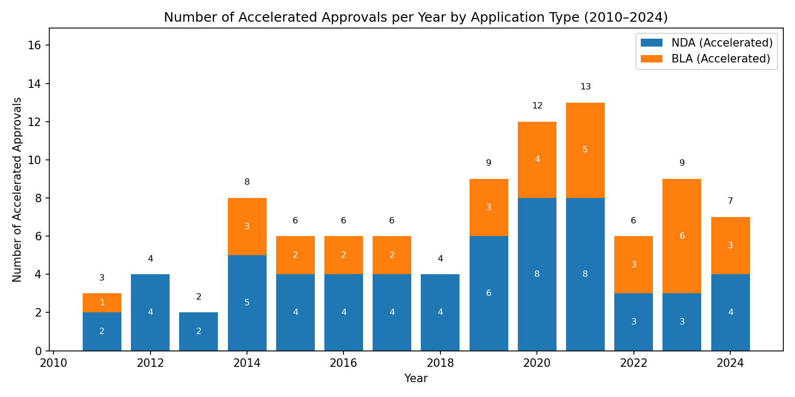
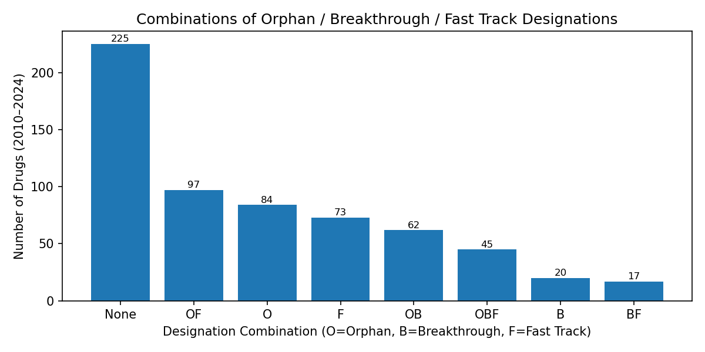
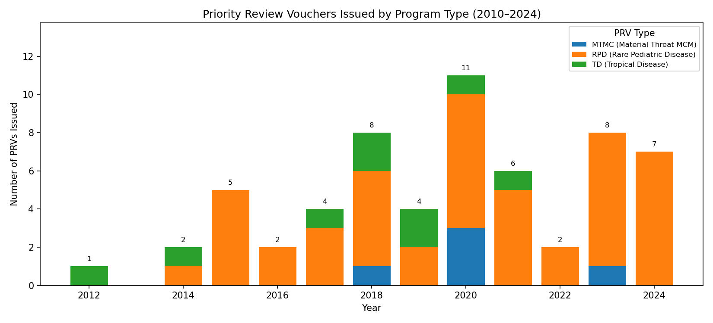

# FDA-Drug-Approvals-Analysis
Data-driven analysis of FDA drug approval trends (2010–2024)

# FDA Drug Approval Trends (2010–2024)

This repository presents a data analysis project exploring **FDA new drug and biologic approvals (2010–2024)** using publicly available data from the U.S. Food and Drug Administration (CDER).  
The project applies **Python-based analytics and visualization** to uncover regulatory and innovation patterns in the biopharmaceutical industry.

---

## Objectives
- Analyze FDA approvals (NDA vs. BLA) from 2010–2024  
- Classify drugs by **therapeutic area**  
- Identify **top applicant companies**  
- Examine **accelerated approval** trends  
- Evaluate **Orphan / Breakthrough / Fast Track** designations  
- Explore **Priority Review Voucher (PRV)** programs

---

## Modules
| # | Title | Focus |
|:-:|--------|--------|
| **01** | FDA Drug Approvals (NDA vs. BLA) | Yearly trends of NME vs. biologic approvals |
| **02** | Approvals by Therapeutic Area | Keyword-based and manual classification |
| **03** | Approvals by Company | Top applicants and merger-adjusted groups |
| **04** | Accelerated Approvals | Annual proportion and growth patterns |
| **05** | Expedited Designations | Orphan / Breakthrough / Fast Track overlap |
| **06** | Priority Review Vouchers | Issuance and redemption (RPD, TD, MTMC) |

---

## Data Source
- **Dataset:** *Compilation of CDER NME and New Biologic Approvals (1985–2024)*  
- **Publisher:** U.S. Food and Drug Administration (FDA), Center for Drug Evaluation and Research (CDER)  
- **Official Link:** [Compilation of CDER NME and New Biologic Approvals](https://www.fda.gov/drugs/drug-approvals-and-databases/compilation-cder-new-molecular-entity-nme-drug-and-new-biologic-approvals?utm_source=chatgpt.com)

---

## Tools
- **Python 3.10**  
- **Libraries:** Pandas, NumPy, Matplotlib  
- **Environment:** Jupyter Notebook  

---

## 📊 Visualization Summary (Modules 01–06)

| Module | Visualization |
|:--------|:---------------|
| 01 — NDA vs BLA Approvals |  |
| 02 — Therapeutic Area Trends |  |
| 03 — Company Landscape |  |
| 04 — Accelerated Approvals |  |
| 05 — Regulatory Designations |  |
| 06 — Priority Review Vouchers |  |

---

## Author
**Dr. Hanjing Wu**  
Ph.D. in Bioengineering | M.S. Candidate in Computer Science, Syracuse University  

📧 Email: hwu188@syr.edu  
🌐 GitHub: [https://github.com/huansha2002](https://github.com/huansha2002)

---

*This repository is shared for educational and research demonstration purposes only.*  
*Unauthorized reproduction or commercial use is prohibited.*  
*This project demonstrates how computational analytics can illuminate FDA regulatory and innovation dynamics.*

